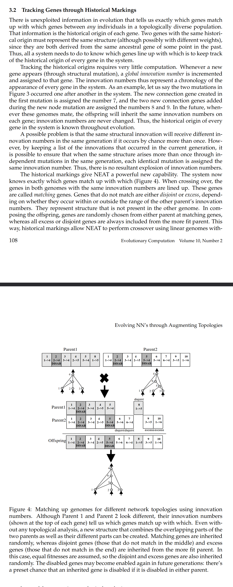

# NEAT

This is implementation of Neural Evolution of Augmenting Topologies using JAX, based on paper of [Kenneth O. Stanley and Risto Miikkulainen](https://nn.cs.utexas.edu/?stanley:ec02). I am huge fan of evolutionary techniques, so decided to design some tiny framework for using this. 

Repository may be a bit of mess, but all main code is in `neat.py`. 

Results roughly after **30 epochs**:


### CODE:
You can run experiment by using:

```
python3 cartpole.py
```

or 
```
python3 pendulum.py
```

or
```
python3 mountaincar.py
```

Cart pole is the easiest one for this one, so it should learn quite quickly. A lot depends also on fitness functions so you may want adjust it for your own experimetns.

### How to use it:

Initialize:
```Python
my_neat = NEAT(INPUT_SIZE,
                    OUTPUT_SIZE,
                    POPULATION_SIZE,
                keep_top = 4,
                nmc = 0.5,
                cmc = 0.5,
                wmc = 0.5,
                bmc = 0.5,
                amc = 0.5,
                N = N,
                δ_th = δ_th)

```

Obrain FeedForwad newtorks:

```Python

networks = my_neat.evaluate()
```

and then iterate through them and activate each:
```Python
for n,network in enumerate(networks):
    
    actions = network.activate(some_input_to_network)
    
    [... your environment steps ...]
    
```

collect obtained reward from each network, keeping the order of execution. Then you can pass fitness to NEAT and evolve it:
```Python
my_neat.update(all_rewards)

δ_th = [... speciation thersh ...]
N = [... additional parameter to control speciation ...]
epsylon = [... evolution drift for weights, and biases ...]

WMC = [... evolution probability for weigths ...]
BMC = [... evolution probability for biases ...]
AMC = [... evolution probability for changing activation functions ...]
NMC = [... evolution probability for making new nodes ...]
CMC = [... evolution probability for for making new connections...]

neat.cross_over(δ_th = δ_th, N = N)
neat.mutate_weight(epsylon = epsylon,wmc=WMC)
neat.mutate_bias(epsylon = epsylon,bmc=BMC)
neat.mutate_activation(amc=AMC)
neat.mutate_nodes(nmc=NMC)
neat.mutate_connections(cmc=CMC)
        
```

### Mating genes:

